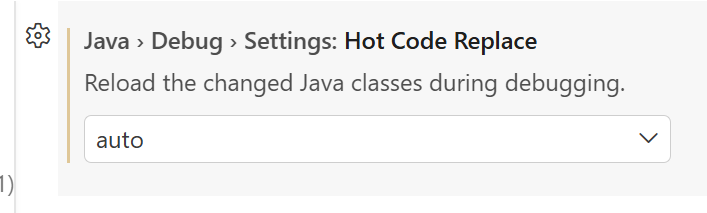
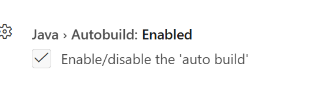

# AI Chat - 全栈智能对话应用

基于 Spring Boot 和 Vue 3 的全栈 AI 聊天应用，支持流式对话、用户认证和会话管理。

## 技术栈

**后端**
- Spring Boot 4 + Spring Security（JWT 认证）
- Spring Data JPA + PostgreSQL（数据持久化）
- Redis（JWT Token 管理，支持登出失效）
- WebClient + SSE（流式调用 AI API）

**前端**
- Vue 3（Composition API + `<script setup>`）
- Element Plus（UI 组件库）
- Marked.js（Markdown 渲染）
- Vite（构建工具）

## 功能特性

- **用户认证** — 注册 / 登录 / 登出，JWT + Redis 实现无状态认证和服务端 Token 失效
- **流式 AI 对话** — 基于 SSE（Server-Sent Events）实时流式输出 AI 回复
- **会话管理** — 多会话支持，历史记录持久化到数据库，支持新建 / 切换 / 删除会话
- **响应式 UI** — 桌面端侧边栏 + 移动端抽屉式布局自适应

## 架构说明

```
┌──────────────┐     HTTP/SSE      ┌──────────────────────────────────────┐
│   Vue 3 SPA  │ ◄──────────────►  │           Spring Boot                │
│              │                   │                                      │
│  AuthView    │   POST /api/auth  │  AuthController ──► UserService      │
│  ChatView    │   POST /api/chat  │  ChatController ──► AI API (WebClient)│
│              │   SSE  /api/chat  │                                      │
└──────────────┘                   │  JwtAuthFilter ──► JwtUtil ──► Redis │
                                   │  JPA Repository ──► PostgreSQL       │
                                   └──────────────────────────────────────┘
```

**认证流程：**
1. 用户登录/注册 → 后端生成 JWT 并存入 Redis → 返回 Token
2. 前端携带 `Authorization: Bearer <token>` 请求受保护接口
3. `JwtAuthenticationFilter` 校验 Token 签名 + Redis 存在性
4. 登出时从 Redis 删除 Token，实现服务端即时失效

**流式对话流程：**
1. 前端 POST 请求 `/api/chat/stream`
2. 后端通过 `WebClient` 调用 AI API（stream 模式）
3. 使用 `SseEmitter` 将每个 chunk 实时推送到前端
4. 完成后将完整对话持久化到数据库

## 快速开始

### 环境要求

- JDK 25+
- Node.js 18+
- PostgreSQL
- Redis

### 配置

在项目根目录创建 `.env` 文件：

```properties
AI_API_KEY=your-api-key
AI_BASE_URL=https://api.openai.com/v1
AI_MODEL=gpt-4o

DB_URL=jdbc:postgresql://localhost:5432/aichat
DB_USERNAME=postgres
DB_PASSWORD=your-password

REDIS_HOST=localhost
REDIS_PORT=6379
REDIS_PASSWORD=

JWT_SECRET=your-jwt-secret-key
```

### 启动

```bash
# 一键构建并启动（会自动构建前端）
./gradlew bootRun

# 或分别启动
cd frontend && npm install && npm run dev   # 前端开发模式（localhost:5173）
./gradlew bootRun                            # 后端（localhost:8080）
```

### Docker 启动(需要先设置置 .env 文件)

```bash
# 1. 复制环境变量模板并填写 AI API 配置和 JWT Secret
cp .env.example .env

# 2. 一键启动所有服务（PostgreSQL + Redis + 应用）
docker compose up -d

# 访问 http://localhost:8080
```

### 运行测试

```bash
./gradlew test
```

## 项目结构

```
aichat-spring/
├── src/main/java/com/liuweiqing/aichat/
│   ├── AichatApplication.java          # 启动类
│   ├── controller/
│   │   ├── AuthController.java         # 认证接口（注册/登录/登出）
│   │   └── ChatController.java         # 聊天接口（发送/流式/会话管理）
│   ├── service/
│   │   └── UserService.java            # 用户业务逻辑
│   ├── security/
│   │   ├── SecurityConfig.java         # Spring Security 配置
│   │   ├── JwtUtil.java                # JWT 生成/验证/Redis 管理
│   │   └── JwtAuthenticationFilter.java# JWT 认证过滤器
│   ├── model/
│   │   ├── User.java                   # 用户实体
│   │   └── Conversation.java           # 会话实体
│   ├── repository/
│   │   ├── UserRepository.java
│   │   └── ConversationRepository.java
│   └── dto/
│       ├── RegisterRequest.java
│       ├── LoginRequest.java
│       └── AuthResponse.java
├── src/test/java/com/liuweiqing/aichat/
│   ├── service/UserServiceTest.java    # UserService 单元测试
│   ├── controller/AuthControllerTest.java # AuthController 接口测试
│   └── security/
│       ├── JwtUtilTest.java            # JWT 工具类测试
│       └── JwtAuthenticationFilterTest.java # 过滤器测试
├── frontend/
│   ├── src/
│   │   ├── App.vue                     # 根组件（认证路由）
│   │   ├── api.js                      # API 请求封装
│   │   ├── main.js                     # 入口文件
│   │   └── components/
│   │       ├── AuthView.vue            # 登录/注册页面
│   │       └── ChatView.vue            # 聊天主界面
│   └── package.json
└── build.gradle
```

## API 接口

| 方法 | 路径 | 说明 | 认证 |
|------|------|------|------|
| POST | `/api/auth/register` | 用户注册 | 否 |
| POST | `/api/auth/login` | 用户登录 | 否 |
| POST | `/api/auth/logout` | 用户登出 | 是 |
| POST | `/api/chat/send` | 发送消息（同步） | 是 |
| POST | `/api/chat/stream` | 发送消息（SSE 流式） | 是 |
| GET  | `/api/chat/conversations` | 获取会话列表 | 是 |
| GET  | `/api/chat/conversation?conversationId=xxx` | 获取会话详情 | 是 |
| POST | `/api/chat/clear` | 删除会话 | 是 |


## vscode 热重载设置开启方法，需spring boot dashboard debug模式启动，文件需要开启自动保存


